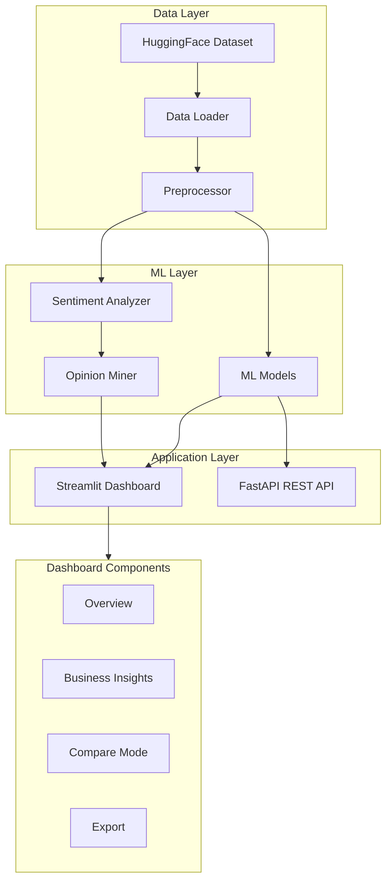

# NLP Sentiment Analysis & Opinion Mining

[](https://github.com/AvishManiar21/nlp-sentiment-analysis/actions/workflows/ci.yml)
[](https://codecov.io/gh/AvishManiar21/nlp-sentiment-analysis)
[](https://www.python.org/downloads/)
[](https://opensource.org/licenses/MIT)
[](https://www.docker.com/)
[](https://huggingface.co/datasets/McAuley-Lab/Amazon-Reviews-2023)

## Live Demo

Try the interactive dashboard: **[NLP Sentiment Analysis App](https://nlp-sentiments-analysis.streamlit.app/)**

---

A production-ready sentiment analysis platform using **real Amazon product reviews** with multiple ML models, business insights, and interactive visualizations.

## Key Features

### Analysis Capabilities
- **Multiple Sentiment Models**: VADER, TextBlob, Logistic Regression (89.6% accuracy), Naive Bayes
- **Deep Learning Models** (NEW!): CNN and BiLSTM with TensorFlow/PyTorch, pre-trained embeddings (GloVe, Word2Vec)
- **Business Insights**: Automated alerts, top issues detection, actionable recommendations
- **Comparison Mode**: Side-by-side brand/category analysis with radar charts
- **Opinion Mining**: Aspect extraction, sentiment drivers, category analysis
- **Temporal Analysis**: Sentiment trends over time

### Dashboard Features
- **8 Interactive Tabs**: Overview, Business Insights, Compare, Categories, Aspects, Trends, Model Performance, Deep Dive
- **Polished Custom Theme**: Consistent, semantic light theme for all charts and components
- **Export Functionality**: Download filtered data as CSV or Excel
- **Real-time Filtering**: Category, brand, sentiment, rating, and date filters

### Production Ready
- **Docker Support**: Multi-container deployment with docker-compose
- **REST API**: FastAPI endpoints for real-time predictions
- **Structured Logging**: JSON logging for monitoring and debugging
- **Modular Architecture**: Clean component-based code structure

## Architecture



## Project Structure

```
nlp-sentiment-analysis/
├── app.py                     # Streamlit dashboard (slim entry point)
├── main.py                    # CLI pipeline script
├── Dockerfile                 # Docker image for dashboard
├── docker-compose.yml         # Multi-service deployment
├── components/                # Modular UI components
│   ├── header.py              # Page header
│   ├── sidebar.py             # Filters and controls
│   ├── kpi_cards.py           # Metric cards
│   ├── charts/                # Chart components
│   │   ├── sentiment.py       # Sentiment charts
│   │   ├── category.py        # Category analysis
│   │   ├── temporal.py        # Time series
│   │   └── comparison.py      # Comparison charts
│   └── tabs/                  # Tab components
│       ├── overview.py        # Overview tab
│       ├── insights.py        # Business Insights tab
│       ├── compare.py         # Comparison Mode tab
│       ├── categories.py      # Categories tab
│       ├── aspects.py         # Aspects tab
│       ├── trends.py          # Trends tab
│       ├── performance.py     # Model Performance tab
│       └── deep_dive.py       # Deep Dive tab
├── utils/                     # Utility modules
│   ├── theme.py               # Theme and styling
│   ├── cache.py               # Data caching
│   ├── export.py              # Export functionality
│   ├── loading.py             # Loading states
│   └── logger.py              # Structured logging
├── src/                       # Core ML modules
│   ├── data_loader.py         # Data fetching
│   ├── preprocessor.py        # Text preprocessing
│   ├── sentiment_analyzer.py  # VADER + TextBlob
│   ├── ml_models.py           # ML training
│   ├── model_evaluator.py     # Evaluation
│   └── opinion_miner.py       # Aspect extraction
├── api/                       # REST API
│   ├── main.py                # FastAPI app
│   ├── schemas.py             # Request/response models
│   └── predictor.py           # Prediction service
└── tests/                     # Unit tests
```

## Quick Start

### Option 1: Docker (Recommended)

```bash
# Clone the repository
git clone https://github.com/AvishManiar21/nlp-sentiment-analysis.git
cd nlp-sentiment-analysis

# Start all services
docker-compose up -d

# Access the dashboard at http://localhost:8501
# Access the API at http://localhost:8000
```

### Option 2: Local Development

```bash
# Clone and setup
git clone https://github.com/AvishManiar21/nlp-sentiment-analysis.git
cd nlp-sentiment-analysis
python -m venv venv
source venv/bin/activate  # Linux/Mac
# venv\Scripts\activate   # Windows

# Install dependencies
pip install -r requirements.txt

# Run the pipeline (downloads data, trains models)
python main.py

# Launch the dashboard
streamlit run app.py

# Or run the API
uvicorn api.main:app --reload --port 8000
```

## Dashboard Tabs

| Tab | Description |
|-----|-------------|
| **Overview** | KPI metrics, sentiment distribution, confusion matrix |
| **Business Insights** | Automated alerts, top issues, recommendations |
| **Compare** | Side-by-side brand/category comparison with radar charts |
| **Categories & Brands** | Category sentiment analysis, brand positioning |
| **Aspects & Drivers** | Aspect-level opinion mining, word clouds |
| **Trends** | Temporal sentiment trends, VADER vs TextBlob comparison |
| **Model Performance** | Accuracy comparison, F1 scores, best models |
| **Deep Dive** | Sample reviews, search functionality |

## Results

### Classical ML Models

| Model | Accuracy | F1 Score | Precision | Recall |
|-------|----------|----------|-----------|--------|
| **Logistic Regression** | **89.6%** | 0.896 | 0.896 | 0.896 |
| Naive Bayes | 87.1% | 0.871 | 0.871 | 0.871 |
| VADER | 70.5% | 0.699 | 0.770 | 0.705 |
| Ensemble | 70.3% | 0.698 | 0.774 | 0.703 |
| TextBlob | 61.5% | 0.622 | 0.794 | 0.615 |

### Deep Learning Models (NEW!)

We now support state-of-the-art deep learning models with both TensorFlow and PyTorch:

| Model | Framework | Embeddings | Expected Accuracy | Description |
|-------|-----------|------------|-------------------|-------------|
| **CNN** | TensorFlow | Learned | ~91-92% | 1D CNN with multiple filter sizes (3,4,5-grams) |
| **CNN + GloVe** | TensorFlow | Pre-trained | ~92-94% | CNN with frozen GloVe embeddings |
| **CNN** | PyTorch | Learned | ~91-92% | Parallel PyTorch implementation |
| **CNN + GloVe** | PyTorch | Pre-trained | ~92-94% | PyTorch CNN with GloVe embeddings |
| **BiLSTM** | PyTorch | Learned/Pre-trained | ~90-93% | Bidirectional LSTM for sequence modeling |

#### Training Deep Learning Models

```bash
# Train CNN models with both TensorFlow and PyTorch
python main.py --train-dl --dl-framework both --dl-model-type cnn

# Train with pre-trained GloVe embeddings for better accuracy
python main.py --train-dl --use-embeddings --embedding-name glove-wiki-gigaword-100

# Train LSTM model (PyTorch only)
python main.py --train-dl --dl-framework pytorch --dl-model-type lstm

# Customize training parameters
python main.py --train-dl --dl-epochs 20 --dl-batch-size 64

# Train all model types
python main.py --train-dl --dl-framework both --dl-model-type both --use-embeddings
```

#### Available Pre-trained Embeddings

- `glove-wiki-gigaword-100` (100d) - Fast, good accuracy
- `glove-wiki-gigaword-200` (200d) - Better accuracy
- `glove-wiki-gigaword-300` (300d) - Best accuracy, slower
- `word2vec-google-news-300` (300d) - Google News corpus
- `glove-twitter-100` (100d) - Optimized for social media
- `fasttext-wiki-news-subwords-300` (300d) - Handles rare words well

#### Deep Learning Features

- **Hybrid Architectures**: Combine pre-trained embeddings with CNNs for state-of-the-art results
- **Multi-Framework Support**: Compare TensorFlow and PyTorch implementations
- **GPU Acceleration**: Automatic GPU detection (CUDA, MPS, or CPU fallback)
- **TensorBoard Integration**: Visualize training metrics and model architecture
- **Early Stopping**: Prevent overfitting with automatic early stopping
- **Model Checkpointing**: Save best models during training
- **Dashboard Integration**: View trained models in the Model Performance tab

📖 **[Read the complete Deep Learning Guide](DEEP_LEARNING_GUIDE.md)** for detailed training instructions, benchmarks, and best practices.

## REST API

### Endpoints

| Method | Endpoint | Description |
|--------|----------|-------------|
| GET | `/` | API info |
| GET | `/health` | Health status |
| GET | `/models` | Available models |
| POST | `/predict` | Single prediction |
| POST | `/predict/batch` | Batch predictions |

### Example

```bash
curl -X POST "http://localhost:8000/predict" \
  -H "Content-Type: application/json" \
  -d '{"text": "This product is amazing!", "model": "logistic_regression"}'
```

```json
{
  "text": "This product is amazing!",
  "model": "logistic_regression",
  "sentiment": "positive",
  "confidence": 0.92,
  "scores": {"positive": 0.92, "negative": 0.08}
}
```

## Docker Deployment

```bash
# Build and run dashboard only
docker build -t nlp-sentiment .
docker run -p 8501:8501 nlp-sentiment

# Run with docker-compose (dashboard + API)
docker-compose up -d

# View logs
docker-compose logs -f

# Stop services
docker-compose down
```

## Environment Configuration

Copy `.env.example` to `.env` and configure:

```bash
cp .env.example .env
```

Key settings:
- `CLOUD_SAMPLE_SIZE`: Number of reviews to process when generating the dataset (default: 30000)
- `CLOUD_MODE`: Set to `true` on Streamlit Cloud to enable lighter, Cloud-optimized defaults
- `CLOUD_DISPLAY_SAMPLE_SIZE`: Maximum number of reviews loaded into the dashboard when `CLOUD_MODE=true` (default: 20000)
- `LOG_LEVEL`: Logging level (DEBUG, INFO, WARNING, ERROR)
- `API_AUTH_ENABLED`: Enable API authentication

## Technologies

- **Python 3.10+** - Core language
- **Streamlit** - Interactive dashboard
- **FastAPI** - REST API
- **scikit-learn** - Classical ML models
- **TensorFlow/Keras** - Deep learning (CNN models)
- **PyTorch** - Deep learning (CNN, BiLSTM models)
- **Gensim** - Pre-trained word embeddings (Word2Vec, GloVe)
- **NLTK/TextBlob** - NLP processing
- **Plotly** - Visualizations
- **TensorBoard** - Training visualization
- **Docker** - Containerization
- **HuggingFace** - Dataset loading & transformers

## License

MIT License - see [LICENSE](LICENSE) for details.

---

Built as a production-ready demonstration of NLP sentiment analysis, from data processing to deployment.
