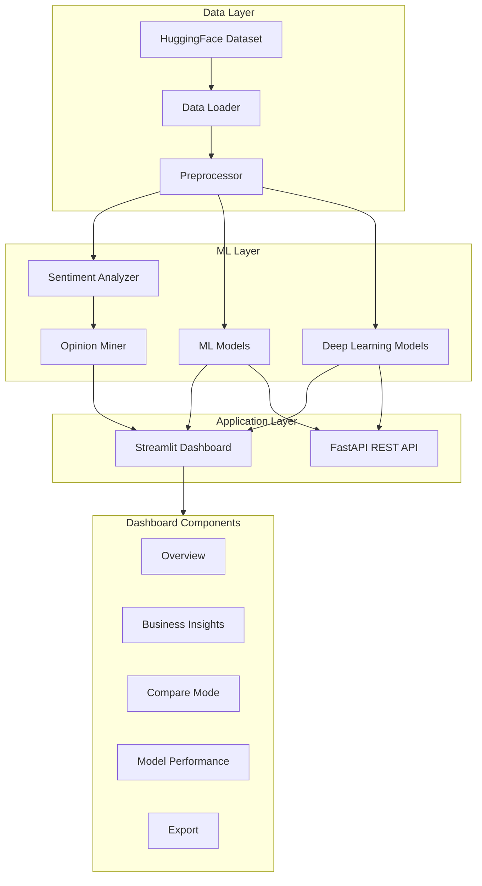

# NLP Sentiment Analysis & Opinion Mining

[](https://github.com/AvishManiar21/nlp-sentiment-analysis/actions/workflows/ci.yml)
[](https://codecov.io/gh/AvishManiar21/nlp-sentiment-analysis)
[](https://www.python.org/downloads/)
[](https://opensource.org/licenses/MIT)
[](https://www.docker.com/)
[](https://huggingface.co/datasets/McAuley-Lab/Amazon-Reviews-2023)

## Live Demo

Try the interactive dashboard: **[NLP Sentiment Analysis App](https://nlp-sentiments-analysis.streamlit.app/)**

---

A production-ready sentiment analysis platform using **real Amazon product reviews** with multiple ML models, business insights, and interactive visualizations.

## Key Features

### Analysis Capabilities
- **Multiple Sentiment Models**: VADER, TextBlob, Logistic Regression, Naive Bayes, CNN, BiLSTM
- **Deep Learning Models**: CNN and BiLSTM with TensorFlow/PyTorch, pre-trained embeddings (GloVe, Word2Vec, FastText)
- **Business Insights**: Automated alerts, top issues detection, actionable recommendations
- **Comparison Mode**: Side-by-side brand/category analysis with radar charts
- **Opinion Mining**: Aspect extraction, sentiment drivers, category analysis
- **Temporal Analysis**: Sentiment trends over time

### Dashboard Features
- **8 Interactive Tabs**: Overview, Business Insights, Compare, Categories, Aspects, Trends, Model Performance, Deep Dive
- **Polished Custom Theme**: Consistent, semantic light theme for all charts and components
- **Export Functionality**: Download filtered data as CSV or Excel
- **Real-time Filtering**: Category, brand, sentiment, rating, and date filters

### Production Ready
- **Docker Support**: Multi-container deployment with docker-compose
- **REST API**: FastAPI endpoints for real-time predictions
- **Streamlit Cloud Deployment**: HuggingFace Hub integration for model storage
- **Structured Logging**: JSON logging for monitoring and debugging
- **Modular Architecture**: Clean component-based code structure
- **CI/CD**: Automated testing and code quality checks with GitHub Actions

## Architecture


```mermaid
flowchart TB
    subgraph DataLayer[Data Layer]
        HF[HuggingFace Dataset]
        DL[Data Loader]
        PP[Preprocessor]
    end

    subgraph MLLayer[ML Layer]
        SA[Sentiment Analyzer]
        ML[ML Models]
        DLM[Deep Learning Models]
        OM[Opinion Miner]
    end

    subgraph AppLayer[Application Layer]
        ST[Streamlit Dashboard]
        API[FastAPI REST API]
    end

    subgraph Components[Dashboard Components]
        OV[Overview]
        BI[Business Insights]
        CM[Compare Mode]
        MP[Model Performance]
        EX[Export]
    end

    HF --> DL
    DL --> PP
    PP --> SA
    PP --> ML
    PP --> DLM
    SA --> OM
    ML --> ST
    DLM --> ST
    ML --> API
    DLM --> API
    OM --> ST
    ST --> Components
```

## Project Structure

```
nlp-sentiment-analysis/
├── app.py                     # Streamlit dashboard (slim entry point)
├── main.py                    # CLI pipeline script
├── Dockerfile                 # Docker image for dashboard
├── docker-compose.yml         # Multi-service deployment
├── components/                # Modular UI components
│   ├── header.py              # Page header
│   ├── sidebar.py             # Filters and controls
│   ├── kpi_cards.py           # Metric cards
│   ├── charts/                # Chart components
│   │   ├── sentiment.py       # Sentiment charts
│   │   ├── category.py        # Category analysis
│   │   ├── temporal.py        # Time series
│   │   └── comparison.py      # Comparison charts
│   └── tabs/                  # Tab components
│       ├── overview.py        # Overview tab
│       ├── insights.py        # Business Insights tab
│       ├── compare.py         # Comparison Mode tab
│       ├── categories.py      # Categories tab
│       ├── aspects.py         # Aspects tab
│       ├── trends.py          # Trends tab
│       ├── performance.py     # Model Performance tab
│       └── deep_dive.py       # Deep Dive tab
├── utils/                     # Utility modules
│   ├── theme.py               # Theme and styling
│   ├── cache.py               # Data caching
│   ├── export.py              # Export functionality
│   ├── loading.py             # Loading states
│   ├── logger.py              # Structured logging
│   └── model_storage.py       # HuggingFace Hub integration
├── src/                       # Core ML modules
│   ├── data_loader.py         # Data fetching
│   ├── preprocessor.py        # Text preprocessing
│   ├── sentiment_analyzer.py  # VADER + TextBlob
│   ├── ml_models.py           # Classical ML training
│   ├── dl_models.py           # Deep learning architectures
│   ├── dl_trainer.py          # DL training loops
│   ├── embedding_manager.py   # Pre-trained embeddings
│   ├── model_evaluator.py     # Evaluation & metrics
│   └── opinion_miner.py       # Aspect extraction
├── api/                       # REST API
│   ├── main.py                # FastAPI app
│   ├── schemas.py             # Request/response models
│   └── predictor.py           # Prediction service
└── tests/                     # Unit tests
```

## Quick Start

### Option 1: Docker (Recommended)

```bash
# Clone the repository
git clone https://github.com/AvishManiar21/nlp-sentiment-analysis.git
cd nlp-sentiment-analysis

# Start all services
docker-compose up -d

# Access the dashboard at http://localhost:8501
# Access the API at http://localhost:8000
```

### Option 2: Local Development

```bash
# Clone and setup
git clone https://github.com/AvishManiar21/nlp-sentiment-analysis.git
cd nlp-sentiment-analysis
python -m venv venv
source venv/bin/activate  # Linux/Mac
# venv\Scripts\activate   # Windows

# Install dependencies
pip install -r requirements.txt

# Run the pipeline (downloads data, trains models)
python main.py

# Launch the dashboard
streamlit run app.py

# Or run the API
uvicorn api.main:app --reload --port 8000
```

## Dashboard Tabs

| Tab | Description |
|-----|-------------|
| **Overview** | KPI metrics, sentiment distribution, confusion matrix |
| **Business Insights** | Automated alerts, top issues, recommendations |
| **Compare** | Side-by-side brand/category comparison with radar charts |
| **Categories & Brands** | Category sentiment analysis, brand positioning |
| **Aspects & Drivers** | Aspect-level opinion mining, word clouds |
| **Trends** | Temporal sentiment trends, VADER vs TextBlob comparison |
| **Model Performance** | Accuracy comparison, F1 scores, best models by metric |
| **Deep Dive** | Sample reviews, search functionality |

## Results

All figures below are measured from the evaluation run served by the live dashboard. They replace earlier projected numbers.

### Full Model Comparison

| Category | Model | Accuracy | F1 (weighted) | F1 (macro) | Precision (w) | Recall (w) |
|---|---|---|---|---|---|---|
| Deep Learning | **CNN + pretrained embeddings (PyTorch)** | **0.8616** | **0.8520** | 0.6661 | 0.8470 | 0.8616 |
| Deep Learning | CNN (TensorFlow) | 0.8552 | 0.8381 | 0.6386 | 0.8321 | 0.8552 |
| Classical ML | Naive Bayes | 0.8541 | 0.8293 | 0.6166 | 0.8315 | **0.8541** |
| Deep Learning | CNN + GloVe (TensorFlow) | 0.8541 | 0.8228 | 0.5736 | 0.8270 | 0.8541 |
| Deep Learning | CNN from scratch (PyTorch) | 0.8524 | 0.8464 | 0.6609 | 0.8423 | 0.8524 |
| Classical ML | Logistic Regression | 0.8294 | 0.8433 | **0.6790** | **0.8638** | 0.8294 |
| Rule-based | Ensemble (VADER + TextBlob) | 0.7989 | 0.7729 | 0.5163 | 0.7580 | 0.7989 |
| Rule-based | VADER | 0.7935 | 0.7707 | 0.5165 | 0.7564 | 0.7935 |
| Rule-based | TextBlob | 0.7684 | 0.7553 | 0.5016 | 0.7614 | 0.7684 |

> **Note:** BiLSTM + GloVe (PyTorch) was trained (31MB model available) but is not included in this comparison as evaluation metrics were not generated during the final evaluation run.

### Best Model per Metric

| Metric | Best Model | Score |
|---|---|---|
| Accuracy | CNN + pretrained (PyTorch) | 0.8616 |
| F1 (weighted) | CNN + pretrained (PyTorch) | 0.8520 |
| F1 (macro) | Logistic Regression | 0.6790 |
| Precision (weighted) | Logistic Regression | 0.8638 |
| Recall (weighted) | Naive Bayes | 0.8541 |
| Cohen's kappa | Ensemble (VADER + TextBlob) | 0.4070 |
| Matthews correlation coefficient | Ensemble (VADER + TextBlob) | 0.4218 |

### Average Accuracy by Model Family

| Family | Models | Avg Accuracy |
|---|---|---|
| Deep Learning | 4 | 0.8558 |
| Classical ML | 2 | 0.8417 |
| Rule-based | 3 | 0.7870 |

---

### Reading These Numbers Honestly

**Accuracy overstates performance here.** The dataset is roughly 83% positive, so a model that predicted "positive" for everything would score in the low 80s without learning anything. The spread between weighted F1 (0.755–0.852) and macro F1 (0.502–0.679) is the size of that distortion.

**Cohen's kappa and MCC are the honest headline.** Both correct for agreement expected by chance, and neither exceeds 0.42 for any model. That places every approach in "moderate agreement" territory, not the high-80s the accuracy column suggests.

**The neutral class is where models fail.** It is the smallest class (~3.5% of reviews) and drives the macro F1 gap. In the Naive Bayes confusion matrix, 115 of 820 actual neutrals are predicted correctly; most are absorbed into positive. Any downstream use of these models should treat neutral predictions as unreliable.

**Deep learning wins, but not by much.** The best CNN beats the best classical model by 0.75 accuracy points (0.8616 vs 0.8541) at substantially higher training cost. Logistic regression still leads on macro F1 and weighted precision, which is the better argument for it than raw accuracy.

**Pre-trained embeddings help in PyTorch, not TensorFlow.** PyTorch CNN improves from 0.8524 to 0.8616 with pre-trained embeddings; the TensorFlow CNN drops from 0.8552 to 0.8541, and its macro F1 falls sharply from 0.6386 to 0.5736. Worth investigating before drawing conclusions about embeddings generally.

---

### Evaluation Methodology

> **Note on comparability:** Rule-based models (VADER, TextBlob, Ensemble) require no training and were scored on the full corpus (~47,500 reviews). Classical ML and deep learning models were scored on a held-out 20% test split (~9,494 reviews). The two groups are therefore not evaluated on identical data, and the comparison table should be read with that in mind.

**Dataset Details:**
- **Source:** HuggingFace `McAuley-Lab/Amazon-Reviews-2023`
- **Categories:** All Beauty, Digital Music, Premium Beauty, Subscription Boxes
- **Class distribution:** 83.2% positive, 13.3% negative, 3.5% neutral
- **Split:** 80/20 train/test, stratified, fixed random seed

**Corpus Sizes:**
- **Full training corpus:** 47,467 Amazon product reviews
- **Rule-based evaluation set:** 47,467 reviews (entire corpus, no split needed)
- **Supervised model evaluation set:** 9,494 reviews (20% held-out test split)
- **Dashboard display:** Shows full corpus (47,467) or cloud-downsampled subset (20,000 when `CLOUD_MODE=true`), filtered based on user selections

## Deep Learning Models

We support state-of-the-art deep learning models with both TensorFlow and PyTorch:

### Supported Architectures

| Model | Framework | Embeddings | Performance | Description |
|-------|-----------|------------|-------------|-------------|
| **CNN** | TensorFlow | Learned | 85.5% accuracy | 1D CNN with multiple filter sizes (3,4,5-grams) |
| **CNN + GloVe** | TensorFlow | Pre-trained | 85.4% accuracy | CNN with frozen GloVe embeddings |
| **CNN** | PyTorch | Learned | 85.2% accuracy | Parallel PyTorch implementation |
| **CNN + GloVe** | PyTorch | Pre-trained | **86.2% accuracy** ⭐ | PyTorch CNN with GloVe embeddings |
| **BiLSTM** | PyTorch | Learned/Pre-trained | Trained (evaluation pending) | Bidirectional LSTM for sequence modeling |

### Training Deep Learning Models

```bash
# Train CNN models with both TensorFlow and PyTorch
python main.py --train-dl --dl-framework both --dl-model-type cnn

# Train with pre-trained GloVe embeddings for better accuracy
python main.py --train-dl --use-embeddings --embedding-name glove-wiki-gigaword-100

# Train LSTM model (PyTorch only)
python main.py --train-dl --dl-framework pytorch --dl-model-type lstm

# Customize training parameters
python main.py --train-dl --dl-epochs 20 --dl-batch-size 64

# Train all model types
python main.py --train-dl --dl-framework both --dl-model-type both --use-embeddings
```

### Available Pre-trained Embeddings

- `glove-wiki-gigaword-100` (100d) - Fast, good accuracy ✅ Recommended
- `glove-wiki-gigaword-200` (200d) - Better accuracy
- `glove-wiki-gigaword-300` (300d) - Best accuracy, slower
- `word2vec-google-news-300` (300d) - Google News corpus
- `glove-twitter-100` (100d) - Optimized for social media
- `fasttext-wiki-news-subwords-300` (300d) - Handles rare words well

### Deep Learning Features

- **Hybrid Architectures**: Combine pre-trained embeddings with CNNs for state-of-the-art results
- **Multi-Framework Support**: Compare TensorFlow and PyTorch implementations
- **GPU Acceleration**: Automatic GPU detection (CUDA, MPS, or CPU fallback)
- **TensorBoard Integration**: Visualize training metrics and model architecture
- **Early Stopping**: Prevent overfitting with automatic early stopping
- **Model Checkpointing**: Save best models during training
- **Dashboard Integration**: View trained models in the Model Performance tab
- **Cloud Deployment**: HuggingFace Hub integration for Streamlit Cloud

📖 **[Read the complete Deep Learning Guide](DEEP_LEARNING_GUIDE.md)** for detailed training instructions, benchmarks, and best practices.

## REST API

### Endpoints

| Method | Endpoint | Description |
|--------|----------|-------------|
| GET | `/` | API info |
| GET | `/health` | Health status |
| GET | `/models` | Available models |
| POST | `/predict` | Single prediction |
| POST | `/predict/batch` | Batch predictions |

### Example Usage

```bash
curl -X POST "http://localhost:8000/predict" \
  -H "Content-Type: application/json" \
  -d '{"text": "This product is amazing!", "model": "logistic_regression"}'
```

**Response:**
```json
{
  "text": "This product is amazing!",
  "model": "logistic_regression",
  "sentiment": "positive",
  "confidence": 0.92,
  "scores": {"positive": 0.92, "negative": 0.08}
}
```

### Available Models via API

- `vader` - VADER sentiment analyzer
- `textblob` - TextBlob polarity
- `ensemble` - VADER + TextBlob ensemble
- `logistic_regression` - Logistic Regression (best macro F1)
- `naive_bayes` - Naive Bayes (best recall)
- `cnn_pytorch_pretrained` - CNN + GloVe (best accuracy)
- `cnn_tensorflow` - TensorFlow CNN
- `lstm_pytorch_pretrained` - BiLSTM + GloVe (if trained)

## Docker Deployment

```bash
# Build and run dashboard only
docker build -t nlp-sentiment .
docker run -p 8501:8501 nlp-sentiment

# Run with docker-compose (dashboard + API)
docker-compose up -d

# View logs
docker-compose logs -f

# Stop services
docker-compose down
```

## Streamlit Cloud Deployment

The project includes HuggingFace Hub integration for deploying to Streamlit Cloud without committing large model files:

1. **Train models locally:**
   ```bash
   python main.py --train-dl --use-embeddings
   ```

2. **Upload to HuggingFace Hub:**
   ```bash
   python scripts/upload_models_to_hub.py YOUR_USERNAME/repo-name
   ```

3. **Deploy on Streamlit Cloud:**
   - Push code to GitHub
   - Connect repository on Streamlit Cloud
   - Set secret: `HF_MODEL_REPO=YOUR_USERNAME/repo-name`
   - Models auto-download on first run

📖 **[Read the Deployment Guide](DEPLOYMENT.md)** for complete deployment instructions.

## Environment Configuration

Copy `.env.example` to `.env` and configure:

```bash
cp .env.example .env
```

**Key Settings:**

| Variable | Description | Default |
|----------|-------------|---------|
| `CLOUD_SAMPLE_SIZE` | Number of reviews to process | 30000 |
| `CLOUD_MODE` | Enable cloud-optimized defaults | false |
| `CLOUD_DISPLAY_SAMPLE_SIZE` | Max reviews in dashboard (cloud mode) | 20000 |
| `LOG_LEVEL` | Logging level | INFO |
| `API_AUTH_ENABLED` | Enable API authentication | false |
| `HF_MODEL_REPO` | HuggingFace model repository | None |

## Technologies

### Core Stack
- **Python 3.10+** - Core language
- **Streamlit** - Interactive dashboard
- **FastAPI** - REST API
- **Docker** - Containerization

### Machine Learning
- **scikit-learn** - Classical ML models (Logistic Regression, Naive Bayes)
- **TensorFlow/Keras** - Deep learning CNN models
- **PyTorch** - Deep learning CNN & BiLSTM models
- **Gensim** - Pre-trained word embeddings (Word2Vec, GloVe, FastText)
- **HuggingFace Datasets** - Amazon Reviews 2023 dataset
- **HuggingFace Hub** - Model storage & cloud deployment

### NLP & Visualization
- **NLTK** - Tokenization, VADER sentiment, lemmatization
- **TextBlob** - Polarity & subjectivity analysis
- **spaCy** - Aspect extraction (optional)
- **Plotly** - Interactive visualizations
- **WordCloud** - Text visualization
- **TensorBoard** - Training visualization

### DevOps & Quality
- **pytest** - Unit testing
- **pytest-cov** - Code coverage
- **GitHub Actions** - CI/CD pipeline
- **codecov** - Coverage reporting
- **flake8** - Code linting

## Testing

```bash
# Run all tests
pytest

# Run with coverage
pytest --cov=src --cov=api --cov=components

# Run specific test file
pytest tests/test_sentiment_analyzer.py

# Run with verbose output
pytest -v
```

## Development

```bash
# Install development dependencies
pip install -r requirements.txt
pip install -r requirements-dev.txt

# Run linter
flake8 src/ api/ components/ tests/

# Format code
black src/ api/ components/ tests/

# Type checking
mypy src/
```

## Contributing

Contributions are welcome! Please:

1. Fork the repository
2. Create a feature branch (`git checkout -b feature/amazing-feature`)
3. Commit your changes (`git commit -m 'Add amazing feature'`)
4. Push to the branch (`git push origin feature/amazing-feature`)
5. Open a Pull Request

## License

MIT License - see [LICENSE](LICENSE) for details.

## Acknowledgments

- **Amazon Reviews 2023 Dataset** by McAuley Lab (HuggingFace)
- **Pre-trained Embeddings** from GloVe, Word2Vec, FastText projects
- **VADER Sentiment** by C.J. Hutto

---

**Built as a production-ready demonstration of NLP sentiment analysis, from data processing to deployment.**

For questions or issues, please open an issue on GitHub.
